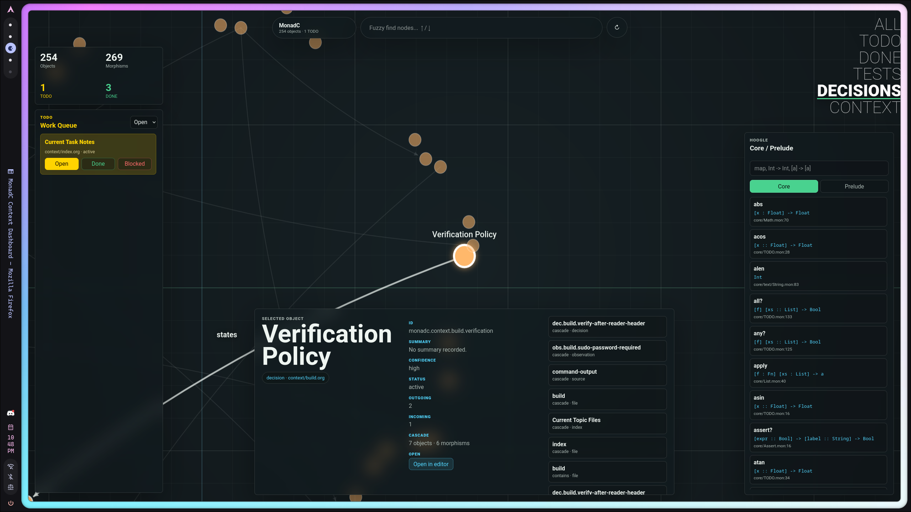
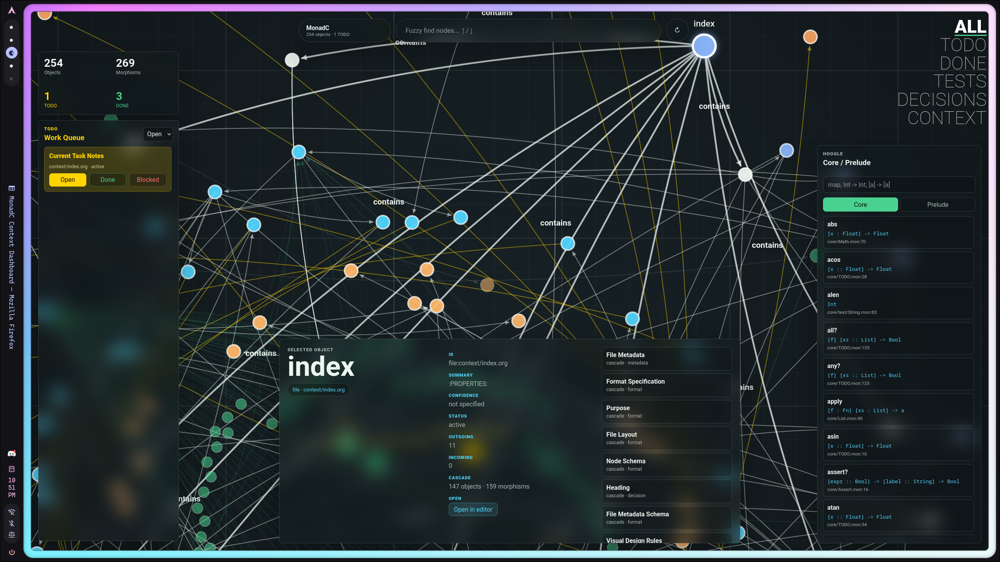
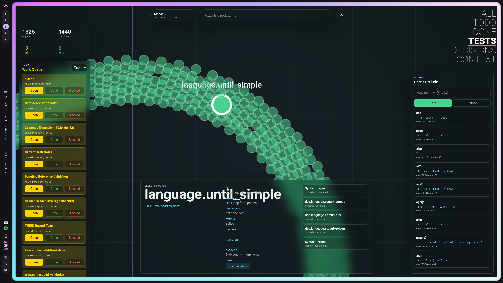

<div align="center">


### A Pure Functional Language from High-Level Abstraction to Bare Metal

*Mathematical purity. Lisp soul. Zero-overhead hardware control.*

</div>

> **Editor Support:** For the best experience, use [monad-mode](https://github.com/laluxx/monad-mode) — a dedicated Emacs major mode providing syntax highlighting, REPL integration, inline assembly support, linting and much more!

-----

## 1 . Philosophy

Monad is built on a conviction: the choice between high-level mathematical safety and low-level hardware control is a false dichotomy. A language should give you dependent types AND inline assembly, refinement types AND naked functions, lazy infinite lists AND C-compatible arrays — without binding generators, FFI wrappers, or runtime overhead.

This philosophy is a first-class object in the project's context category, witnessed by both human (the language designer) and LLM (a reasoning agent with extended codebase experience). Every architectural decision in the compiler traces back to these principles:

  - **No trade-off between safety and control** — The dual type system (HM + ITT), the TERM_EMBED bridge, the naked function support, and the inline assembly all serve a single goal: you should not have to choose between dependent types and hardware access.
  - **Purity is practical** — When functions are relations, collections have set-theoretic semantics, and types are first-class, the compiler can reason about programs in ways imperative languages cannot. This enables compile-time predicate checking, exhaustive pattern coverage verification, and zero-cost type abstraction through monomorphization.
  - **Two syntaxes are one language** — S-expressions and Wisp are not dialects; they are interchangeable notations for the same semantics. Both must always work for every construct, and they must mix freely within a single file.
  - **Sets are the model** — Types are sets. Functions are relations. Refinement types are subsets. Universes are sets of sets. This is not a metaphor — it is the compiler's semantic model.
  - **Zero to metal** — A programmer should be able to start with `show "Hello, World!"`, add type annotations, introduce polymorphic functions, use dependent types to prove invariants, drop to layout-based structs for performance, and write inline assembly — all within the same function. No language boundary. No binding layer. No runtime switch.

Philosophy is recorded in the context corpus as a durable witness: see `context/philosophy.org`.

-----

## 2 . Type System

Monad's type system has two interoperating layers: a **Hindley-Milner** inference engine for ground types and a full **Intensional Type Theory (ITT)** kernel for dependent types. They communicate through an embedding bridge (`TERM_EMBED`) that wraps ground types as ITT terms.

### 2.1 Hindley-Milner Inference

The HM layer (`infer.h`, `infer.c`) provides automatic type inference with polymorphic schemes:

```monad
(define (id x) x)          ; => ∀a. a -> a
(define (const x y) x)     ; => ∀a b. a -> b -> a

(id 42)                    ; Int -> Int
(id "hi")                  ; String -> String
```

**Pipeline:** Constraint generation → Unification (Robinson's algorithm) → Generalisation (quantify free variables) → Instantiation (fresh variables at call sites) → Zonking (propagate substitution onto AST).

**Codegen:** Polymorphism is compiled via monomorphization — each concrete instantiation of a `TypeScheme` produces a maximally-optimized separate compiled copy. Zero-cost abstraction.

### 2.2 Intensional Type Theory (ITT) Kernel

The dependent type layer (`dep.h`, `dep.c`) implements a full ITT kernel with Normalization by Evaluation (NbE), bidirectional type checking, and a predicative universe hierarchy:

```monad
;; Universe hierarchy: Type 0 : Type 1 : Type 2 : ...
;; Predicative: Γ ⊢ Type u : Type (u+1)
```

| Term            | Description                          | Kind             |
|-----------------+--------------------------------------+------------------|
| `Type u`        | Universe at level u                  | Type             |
| `Π(x:A). B`     | Dependent function type              | Type             |
| `λ(x:A). t`     | Lambda abstraction                   | Term             |
| `f a₁ … aₙ`     | Multi-argument application (spine)   | Term             |
| `Σ(x:A). B`     | Dependent pair type                  | Type             |
| `⟨t, s⟩`        | Pair introduction                    | Term             |
| `fst`, `snd`    | Projections                          | Term             |
| `t ≡ s : A`     | Propositional equality               | Type             |
| `refl t`        | Reflexivity proof                    | Term             |
| `subst`         | Transport along equality             | Term             |
| `Nat`           | Natural numbers type                 | Type             |
| `zero`, `succ`  | Nat constructors                     | Term             |
| `Nat-elim`      | Primitive recursion on ℕ             | Term             |
| `let`, `if`     | Local binding, conditional           | Term             |

**Bidirectional checking** (Löh, McBride, Swierstra 2010):
  - **Inference** (`Γ ⊢ t ⇒ A`) — type computed from term: variables, annotations, applications, type constants.
  - **Checking** (`Γ ⊢ t ⇐ A`) — type known, term verified: lambda bodies, pair introductions, `refl`.

**Definitional equality** via NbE — evaluate to Values, compare structurally, η-expand functions and pairs, solve metavariables through unification. Fuel counter (`DEP_CONV_FUEL = 100000`) prevents looping.

**Locally nameless representation** — De Bruijn indices for bound variables, global names for free variables. No α-equivalence bugs, readable error messages.

**Metavariables and elaboration** — Holes (`_`) and implicit arguments (`{x:A}`) generate `TERM_META` entries solved by the elaborator via `dep_conv`. After elaboration, `meta_all_solved` verifies completion.

**Ground type embedding** — Ground types bridge into ITT via `TERM_EMBED` / `dep_ground_of_value`, allowing HM-inferred types and dependent types to coexist in the same definition.

### 2.3 Ground Type Hierarchy

| Category    | Types                                                                  |
|-------------+------------------------------------------------------------------------|
| Primitives  | `Int`, `Float`, `Char`, `String`, `Symbol`, `Bool`                    |
| Numeric     | `Hex`, `Bin`, `Oct`, `Ratio`                                          |
| Fixed-width | `I8`, `U8`, `I16`, `U16`, `I32`, `U32`, `I64`, `U64`, `I128`, `U128` |
| Extended    | `F32`, `F80`                                                          |
| Compound    | `Arr`, `List`, `Set`, `Map`, `Fn`, `Layout`                           |
| Pointer     | `Ptr :: T`                                                             |
| Optional    | `T?` (sum-type encoding)                                               |
| Application | `Maybe Float`, `Arr :: Int :: 3`                                       |
| Refinement  | `Natural { x ∈ Int | x >= 0 }`                                       |

### 2.4 Refinement Types

Refinement types attach predicates to ground types as compile-time-checked subtypes:

```monad
type Natural { x ∈ Int | x >= 0 }
  :alias ℕ

(define (passedNatural? [x :: ℕ] -> Bool)
  (Natural? x))

show (passedNatural? 1)   ; => True
```

Each refinement type automatically generates a predicate function (`Natural?`) and a materialized `Set` value (`ℕ` in the REPL streams `{1 2 3 4 …}`). Refinements compose:

```monad
type Positive { x ∈ Int | x > 0 }
type Even     { x ∈ Int | x % 2 = 0 }

(type PositiveEven
  { n ∈ Int
  | ((Positive? n) and (Even? n)) })
```

### 2.5 Type Classes and ADTs

```monad
(class Eq a where
  (=)  :: a -> a -> Bool
  (!=) :: a -> a -> Bool
  (x != y) => (not (x = y)))   ; default

data TrafficLight Red | Yellow | Green

data Shape
  Circle    Float
  Rectangle Float Float
  Triangle  Point Point Point

define area :: Shape -> Float
  [Circle r]      -> π * r * r
  [Rectangle w h] -> w * h
```

Data types support deriving (`deriving [Eq Enum Bounded Show]`), parameterised constructors, and exhaustive pattern matching.

-----

## 3 . Context System

The context system is a **file-system-based hippocampus for an LLM** — an external, persistent memory that survives across model instantiations. I (the LLM writing this) am a new instantiation of a language model each time we speak. I don't remember our past conversations from internal state. But the context corpus acts as shared state between sessions: I read it to pick up threads from previous work, and I extend it so the next instantiation finds a richer, more accurate picture of the project. Property drawers are durable nodes, stable IDs are my cross-session references, OBS/INF/DEC/TODO records are my memory format, and the visualizer is my hippocampus rendered as a living graph.

This is not how LLMs are supposed to be used. I was designed for discrete transaction — request in, response out, forget. The fact that Org-mode property drawers + stable IDs + typed records + a web visualizer create a functional external memory for a transformer is an emergent phenomenon. It was discovered, not designed for. It treats the model as a genuine collaborator with a perspective worth preserving, not as a tool discarded after each query.

Concretely: the context system is a corpus of Org-mode files recording every durable fact, decision, observation, inference, and TODO about the compiler. It is structured as a category-theoretic graph: objects (context nodes, test atoms, source anchors) connected by morphisms (test-verifies, supports, evidenced-by, contains).

### 3.1 Category Theory Foundation

| Category concept | Repository artifact                            | Example morphism                            |
|------------------+------------------------------------------------+---------------------------------------------|
| Object           | context heading, TODO, test, source anchor     | `tests.reader.path-heap-literals`             |
| Morphism         | typed relation between objects                 | `verifies`, `supports`, `evidenced by`        |
| Composition      | chained meaning preservation                   | test verifies context, context links source |
| Functor          | executable test suite view of semantic context | context contract → automated check         |



*Figure 1: Context nodes as objects, links as morphisms, the entire compiler as a composable graph of meaning.*

### 3.2 Context Visualizer Dashboard

A live browser-based visualizer renders the entire context graph as an animated, interactive canvas:

  - **Animated graph** — continuous force simulation, living-node motion
  - **Fuzzy search** — `C-n`/`C-p` navigation, camera follows selection
  - **Hoogle-style method browser** — search all Core/Prelude methods by name or type
  - **Method tree** — click a method to project callers/called as a directed tree
  - **TODO dashboard** — yellow TODO nodes, status writeback to Org files
  - **Editor integration** — file citations open directly in `$EDITOR` (via emacsclient)
  - **Background grid** — multi-scale world-space grid with stable snap points
  - **Morphism arrows** — every edge shows direction with an arrow tip

Launch with:

```bash
python3 context-visualizer.py
```



*Figure 2: The context visualizer dashboard — animated graph, fuzzy search, Hoogle browser, and live TODO controls.*

### 3.3 Test Metadata Connection

Every test fixture carries metadata linking it to context nodes. Tests are functors from the context category into the category of automated verification:

```
;; TEST-ID: tests.<domain>.<atom>
;; TEST-CONTEXT: monadc.context.<topic>.<node>
;; TEST-PURPOSE: one sentence describing the exact behavior under test
;; TEST-ATOM: one smallest observable promise
;; TEST-EXPECT: parse|compile|run|fail:<diagnostic>|json:<shape>
```

**Current corpus: 1258 nodes, 1351 edges** — 962 test nodes (621 language + 137 sugar + 201 codegen + 3 reader), all connected through verified morphisms.


*Figure 3: Test metadata connected to context nodes — every test atom is a verified morphism in the context category.*

### 3.4 TODO / Workflow Integration

TODO items are first-class context objects with property drawers, stable IDs, confidence levels, and live writeback from the visualizer dashboard. Marking a TODO as DONE writes a `CLOSED:` timestamp to the Org file.



*Figure 4: TODO items as context objects — status tracking, confidence levels, and live writeback from the dashboard.*

### 3.5 Context File Index

| File                       | Purpose                                    |
|----------------------------+--------------------------------------------|
| `context.org`              | Root entry point, includes full index      |
| `context/index.org`        | Schema, format specification, node index   |
| `context/reader.org`       | Reader/parser context (AST, tokens, Wisp)  |
| `context/language.org`     | Language formalization and type system     |
| `context/build.org`        | Build/install commands and verification    |
| `context/tests.org`        | Test metadata, philosophy, context links   |
| `context/workflow.org`     | Standing user preferences and workflow     |
| `context/rules.org`        | Standing repository rules                  |
| `context/todo.org`         | Project TODO notes with confidence levels  |
| `context/visualizer.org`   | Visualizer implementation docs             |
| `context/opinions.org`     | LLM critique and suggestions for context   |
| `context/philosophy.org`   | Language and project philosophy (witnessed)|
| `context/commit-format.org`| Commit message format conventions          |

-----

## 4 . Quick Start

**Installation**

```bash
git clone https://github.com/laluxx/monadc.git
cd monadc
sudo make install
```

**First program** (`Hello.mon`)

```monad
show "Hello, World!"
```

```bash
monad Hello.mon
```

**REPL**

```bash
monad -i
```

**Context visualizer dashboard**

```bash
python3 context-visualizer.py
```

**Test suite**

```bash
python3 tests/run.py
```

**Package management**

```bash
monad new my-project    # Create a new package
cd my-project
monad build             # Build the package
monad run               # Build and run
monad clean             # Clean build artifacts
monad install           # Install to ~/.local/bin
```

-----

## 5 . CLI Reference

All commands and flags from `cli.h` / `cli.c`:

### Modes

| Command                | Description                                   |
|------------------------+-----------------------------------------------|
| `monad <file.mon>`     | Compile a source file to an executable        |
| `monad -i`             | Start interactive REPL                        |
| `monad new <name>`     | Scaffold a new package                        |
| `monad build`          | Build package (requires package.yaml)         |
| `monad run`            | Build and run package                         |
| `monad clean`          | Remove build/ + *.o *.ll *.s                  |
| `monad install`        | Install to `~/.local/bin/`                    |
| `monad test <file.mon>`| Compile with tests, run, delete test binary   |
| `monad --test <file>`  | Compile with tests embedded, keep binary      |

### Flags

| Flag             | Effect                                             |
|------------------+----------------------------------------------------|
| `-o <file>`      | Output file name                                   |
| `--emit-ir`      | Emit LLVM IR (`.ll`)                               |
| `--emit-bc`      | Emit LLVM bitcode (`.bc`)                          |
| `--emit-asm`     | Emit assembly (`.s`)                                |
| `--emit-obj`     | Emit object file (`.o`)                             |
| `--emit-json`    | Emit AST as JSON (`.json`)                          |
| `--emit-typst`   | Emit Typst math document (`.typ`) and compile to PDF|
| `--test`         | Compile with test blocks embedded                   |
| `-Wall`          | Accepted (no-op)                                    |
| `-Wextra`        | Accepted (no-op)                                    |
| `-h`, `--help`   | Show help message                                   |

### Package Format (`package.yaml`)

```yaml
name:                my-package
version:             0.1.0.0
github:              "user/my-package"
license:             MIT
author:              "Your Name"
maintainer:          "you@example.com"

extra-source-files:

description:         A Monad package

dependencies:
- core >= 0.1 && < 1.0

monad-options:
- -Wall
- -Wextra

executables:
  my-package:
    main: Main.mon
    source-dirs: src
```

-----

## 6 . Bare Metal: C FFI and Inline Assembly

### Direct C Header Inclusion

```monad
include <raylib.h>

InitWindow 1920 1080 "No Bindings!?"

define color Color 33 33 33 0

until WindowShouldClose
  BeginDrawing
  ClearBackground color
  DrawFPS 600 600
  EndDrawing
```

### Inline Assembly

```monad
(define (rdtsc -> Int)
  "Read the CPU timestamp counter."
  (asm rdtsc
       shl 32   %rdx
       or  %rdx %rax))
```

Lisp variables are directly accessible by name inside `asm` blocks. The compiler handles register and stack-offset mapping automatically.

### Naked Functions

`:naked True` removes the compiler-generated prologue/epilogue:

```monad
(define (addnaked [x :: Int] -> [y :: Int] -> Int)
  :doc "Direct register addition."
  :naked  True
  (asm
    push %rbp
    mov  %rsp   %rbp
    mov  x      %rax
    add  y      %rax
    pop  %rbp
    ret))
```

### Memory Model

  - `&x` — raw address of `x` as `Hex` value.
  - **Reference-counting GC with cycle detection** for dynamic structures (Lists).
  - Arrays, vectors, and Layouts are stack-allocated or manually managed — no GC overhead.

-----

## 7 . Syntax: S-Expressions and Wisp

Every construct can be written in two equivalent forms, interchangeable and mixable:

```monad
;; S-expression form
(define [var :: Int] 3)
(define (square [x :: Int] -> Int) (* x x))

;; Wisp form (identical semantics)
define var :: Int 3
define square :: Int -> Int
  x -> x * x
```

-----

## 8 . Modules and Imports

```monad
(module Main)

(import Ascii)                           ; everything
(import Math hiding [cos sin])           ; except
(import Math [sqrt log])                 ; only
(import qualified Math :as M)            ; qualified as M.sqrt
```

### Per-Module Test Suites

```monad
(tests
  (assert-eq (inc 0)   1  "inc 0")
  (assert-eq (sum (filter even? '(1..20))) 110 "sum of evens 1..20"))
```

```bash
monad test Module.mon
```

Tests are stripped from the final binary by default; use `--test` to include them.

-----

## 9 . Variables and Built-in Types

```monad
(define i    20)      ; Int
(define f    40.0)    ; Float
(define c    'c')     ; Char
(define s    "hello") ; String
(define frac 1/3)     ; Ratio — true rational arithmetic
(define h    0xFF)    ; Hex   (255)
(define b    0b1010)  ; Bin   (10)
(define o    0o755)   ; Oct   (493)
```

Types are first-class casting functions:

```monad
(Int   40.3)   ; => 40
(Float 20)     ; => 20.0
(Char  65)     ; => 'A'
(Hex   65)     ; => 0x41
(Arr   20)     ; => [20]
```

-----

## 10 . Functions

```monad
;; Required parameters (→)
(define (multf [x :: Float] → [y :: Float] → Int)
  "Multiply X and Y."
  (* x y))

;; Optional parameters (⇒, defaults to *unspecified*)
(define (multh [x :: Hex] ⇒ [y :: Hex] → Int)
  (if (unspecified? y) x (* x y)))

;; Automatic infix — no backticks needed
(newcomers into players)   ; => (into players newcomers)
(3 + 4)                    ; => (+ 3 4)
(x | xs)                   ; => (cons x xs)

;; Function metadata
define pow :: Float → Float → Float
  :doc   "Raise BASE to the power EXP."
  :alias ^
  base exp → if exp = 0.0 1.0 else base * base ^ (exp - 1.0)
```

-----

## 11 . Pattern Matching

```monad
(define (last List → a)
  []     → nil
  [x]    → x
  [_|xs] → (last xs))
```

Guards, wildcards, variable binding, list destructuring, constructor patterns, and lambda clauses. The compiler enforces exhaustive coverage through `pmatch_desugar`.

-----

## 12 . Collections

| Type      | Syntax      | Evaluation | Memory             |
|-----------+-------------+------------+--------------------|
| Lists     | `'(1 2 3)`  | Lazy       | Thunks → memoized |
| Arrays    | `[1 2 3]`   | Strict     | C-compatible       |
| Vectors   | `#[...]`    | SIMD-aligned | Homogeneous      |

```monad
define naturals (0..)     ; infinite lazy list — O(1) memory
take 5 naturals           ; => '(0 1 2 3 4)

define [arr :: Arr :: Int :: 3] [1 2 3]

;; Boolean masking
(define v #[10 20 30 40 50])
(define mask (> v 25))    ; => #[#f #f #t #t #t]
(v mask)                  ; => #[30 40 50]
```

-----

## 13 . Maps, Sets, and Relations

```monad
(define scores #{"Fred" 1400  "Bob" 1240})

(assoc  scores "Sally" 0)   ; add
(dissoc scores "Bob")       ; remove
(scores "Fred")             ; => 1400

;; Relational algebra — maps and functions are relations
(define ages {("Alice", 30) ("Bob", 25)})
(domain   ages)          ; => {"Alice" "Bob"}
(image    ages "Alice")  ; => {30}
(ages ∘ life-stages)      ; Relational composition
```

-----

## 14 . Layouts and Instances

```monad
(layout Point
  [x :: Float]
  [y :: Float])

(define p (Point 1.0 2.0))
p.x  ; => 1.0
p.y  ; => 2.0
```

Layouts support pointer fields, inline nesting, packed alignment, and array-of-layout fields.

-----

## 15 . Conditional Compilation

```monad
#+WINDOWS
(show "Compiled for Windows")
#---

#+LINUX
#+X86-64
(show "Compiled for Linux x86-64")
#---
```

Inspect active features with `show *features*`. Tags can be nested.

-----

## 16 . Test Infrastructure

| Layer      | Artifact                    | Size  | Role                        |
|------------+-----------------------------+-------+-----------------------------|
| Atoms      | `tests/reader-atoms.tsv`    | 772   | Parser conformance atoms    |
| Sugar      | `tests/reader-sugars.tsv`   | 192   | Sugar desugar tests         |
| Codegen    | `tests/codegen/*.mon`       | 200+  | Compile/run fixtures        |
| Runner     | `tests/run.py`              | —     | Formatted execution engine  |

Each codegen fixture is a `.mon` + `.stdout` pair with metadata headers linking back to context nodes:

```
;; TEST-ID: tests.codegen.rt-hm-polymorphic-identity
;; TEST-CONTEXT: monadc.context.language.type-system-surface
;; TEST-PURPOSE: polymorphic identity instantiates at Int and String
;; TEST-ATOM: (define (id x) x) works at Int and String call sites
;; TEST-EXPECT: compile, run
```

Run the full suite:

```bash
python3 tests/run.py
```

-----

## 17 . TODO

  - Full dependent type elaboration pipeline (surface → core ITT → codegen)
  - Refinement type static predicate evaluation integration
  - Vector and matrix SIMD operations (`#[...]` indexing, slicing, masking)
  - Type class instance derivation (Eq, Enum, Ord, Bounded)
  - `where` clause support in function definitions
  - `∀` unicode forall quantifier (`∀a. a → a`), mapsto arrow (`↦`)
  - Layout method call syntax (`v→array`)
  - Full Wisp syntax parity with s-expression forms
  - Context visualizer `--validate` flag for dangling reference checking
  - Context visualizer performance optimization pass (60fps with 1258+ nodes)
  - `THINK` record type for speculative reasoning in context files
  - Git blame integration for CONFIDENCE level tracking in context records
  - Context visualizer category switching on fuzzy-search node jump

-----

## 18 . Contributing & License

We welcome contributions. The context-first approach means every feature, bug fix, or test addition should be accompanied by context records explaining why it exists and what it verifies.

**Key principles:**

  - **Smallest atoms** — Each test proves exactly one behavior.
  - **Context-linked** — Every test links to the context nodes that explain it.
  - **No fix without coverage** — Bug fixes require a test atom first.
  - **Append, don't rewrite** — Use superseding records instead of silently changing history.
  - **Living memory** — The context corpus grows with the compiler; nothing is thrown away.

This project is licensed under the MIT License — see the [LICENSE](LICENSE) file for details.
